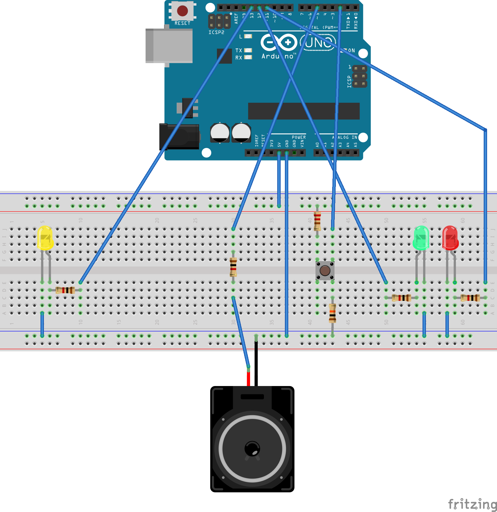

### What is it?

An ongoing project to build an Arduino-based repeating game device. By the end
the device will feature multiple buttons that will flash in a random sequence
and then will record whether the player accurately reproduced the pattern.
Since this is a project for practicing our skills we may end up taking the
design in other directions as well.

### Why?

This is being developed as part of the Berkshire County (Massachusetts)
Technology Group's monthly Microcontroller Programming meetings. A repeating
game device combines a number of interesting problems that will help us
increase our knowledge of Arduino programming and board design.

### Components

- [An Arduino sketch file](start.ino)
- [A Fritizing diagram for constructing the board](diagram.fzz) (NOT functional
  at the moment)

### Diagram

Note, this isn't the correct diagram yet.

